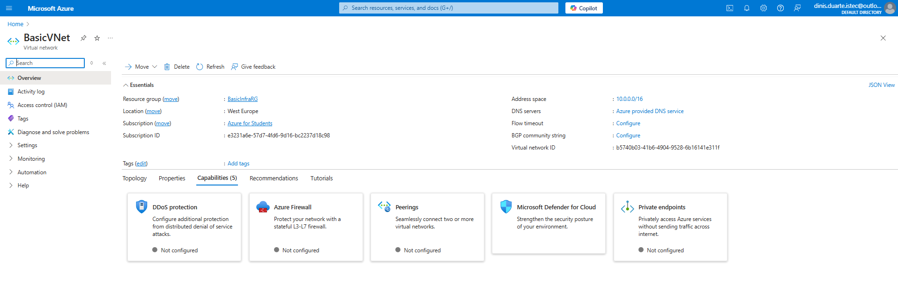
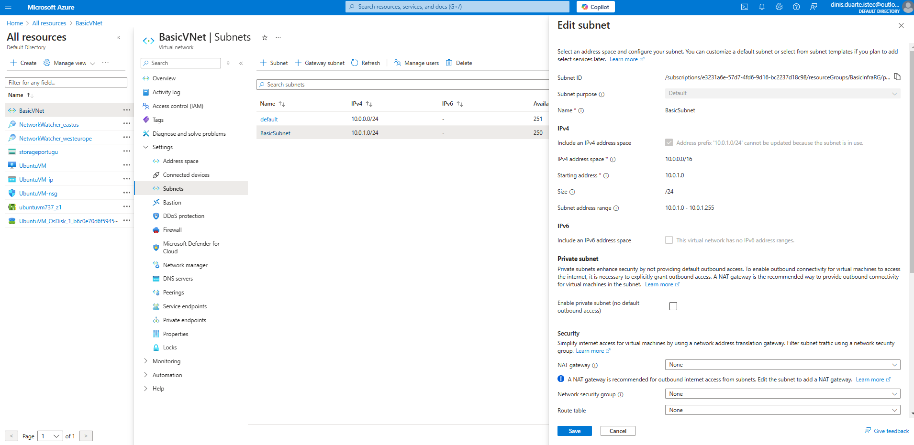
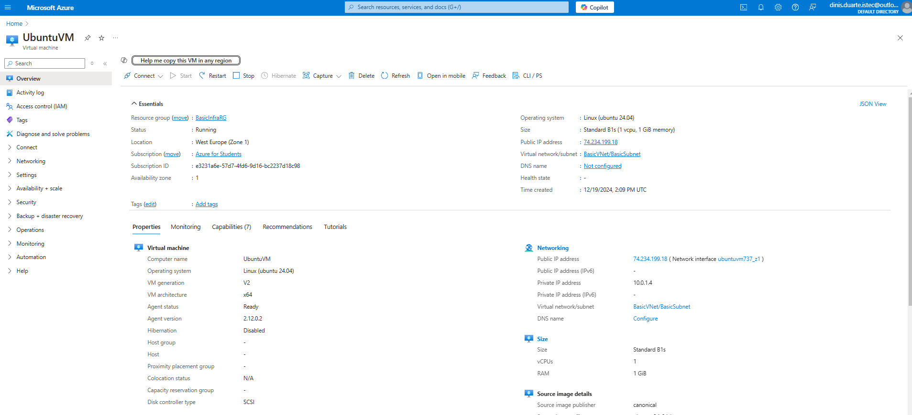
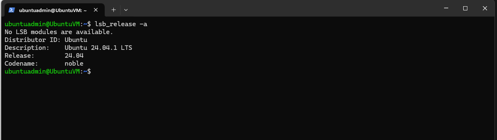

# Azure Basic Infrastructure Project

This project demonstrates how to create a basic infrastructure in Azure, including:

- **Virtual Network (VNet)** with two subnets (`default` and `BasicSubnet`).
- **Virtual Machine (VM)** running Ubuntu Server 20.04.

## Network Configuration
- **VNet Address Space:** `10.0.0.0/16`
- **Subnets:**
  - `default` - `10.0.0.0/24`
  - `BasicSubnet` - `10.0.1.0/24`

## Virtual Machine Configuration
- **Name:** UbuntuVM
- **Image:** Ubuntu Server 20.04 LTS
- **Size:** B1s (free tier)
- **Authentication:** SSH Key
- **Port:** 22 (SSH)

## Screenshots
Below are screenshots of the configurations:

### Virtual Network Configuration


### Subnet Configuration


### Virtual Machine Configuration


### SSH Connection


## SSH Connection
To connect to the VM via SSH:
```bash
ssh ubuntuadmin@<PUBLIC_IP>
